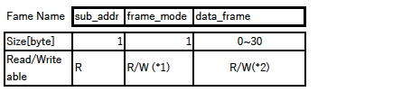
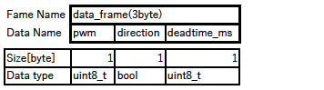
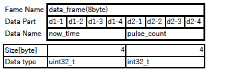
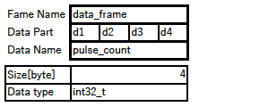
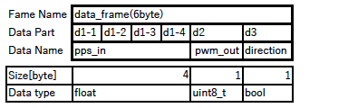

# MDController_v3 I2C規格書

------

　本文書では[README.md](../README.md)にある通常モードでのホストマイコンとのやり取りについて説明します。

　なお、MDController(以降MDCと記述)をスレーブ、ホストマイコンをマスターとして標準速度(0.1Mbps)のI2Cバスが成立している前提で次より説明をしていきます。

------

[TOC]

------

## 特徴

- やり取りはI2Cの受送信要求に基づき行われます。

- データフレームでは呼び出すレジスタと渡すデータをワンセットにしています。

- プログラム上での扱いやすさを考慮しデータは1byte(8bit)を単位として扱っているので、
  例えば、bool型は1bitでも表現できますがビット演算の表現を避けるために8bitで扱っています。

- 単純さを重視して、コンフィグの変更はUARTの方で行うこととし、設定レジスタ等は設けていないので、単一のフレーム形式でレジスタと交信ができます。

- 制御とオドメーターを両立できるような仕様になっています。多分。

## レジスタアクセス

　受信要求の際のデータフレームを用いて各機能を担当しているレジスタの書き換えができます。フレームの形式は次の1つのみです。

- **sub_addr**

　どの機能レジスタを指しているのかを識別する部分です。0~255の中で特定の番号に対応した機能にアクセスできます。

- **frame_mode**

　現在のデータフレームの状態を表し、機能レジスタに動作を指定することができます。状態は次の通りです。

| 状態       | 値  | 説明                                      |
| --------- | --  | ---------------------------------------- |
| Standby   | 0   | ノードが待機しています。またはさせます。        |
| Receive   | 1   | 受信要求を行います。                         |
| Request   | 2   | 送信要求を行います。                         |
| Response  | 3   | 送信要求に対しMDCからの返信を表します。         |
| NullFrame | 255 | MDCからの返信で、空のデータを示すフレームです。   |

- **data_frame**

　最大30byteのデータが入ります。中身についてはデータフレームの項目を参照してください。

## 送信処理

　ホストマイコンがMDCにデータを送信する処理について説明します。

　MDCに対応したI2Cスレーブアドレスを指定しデータを送信します。データフレームには、希望するレジスタの位置をsub_addrで指定します。
　frame_modeにReceive(=1)を入れ、data_frameにはそのレジスタに対応するデータを入れます。
　データは連続送信で送ってください。

## 受信処理

　MDCからホストマイコンへデータを受信する処理について説明します。

1. MDCに対応したI2Cスレーブアドレスを指定しデータを送信します。データフレームには、希望するレジスタの位置をsub_addrで指定します。
   frame_modeにRequest(=2)を入れ、data_frameは空で構いません。データは連続送信で送ってください。

2. MDCにI2Cの送信要求を送信します。

3. 受信したデータのsub_addrが希望するものであるかと、frame_modeにResponse(=3)が入っているかを確認して、問題がなければデータフレームを受理してください。

4. 以上の手順を踏んで、データの返信に不備があった場合、MDCは再度の送信要求に対して、不備があったsub_addrのResponse(=3)のデータを正しく返信が行われるまで返信します。時間切れ等により、再送状態を解除したい場合はそのsub_addrに対して、frame_modeをStandby(=0)としたデータを送信してください。

※ 返信データが現在MDCにない場合は、sub_addr=0でframe_modeがNullFrame(=255)のデータが返信されます。

## データフレーム

　MDCの機能レジスタごとのデータフレーム構造について説明します。この機能レジスタをMDCではノードと呼んでいます。

### Testノード

- Sub Address = 0x00

　I2Cの動作をチェックする等の目的で配置されています。PingPongや接続チェック等に活用ください。

#### 受信データ(MDC→ホスト)

　データフレームを2byte分使用し2つのデータを送信する。

- `pong`

  0xFFが固定で代入されています。

- `total_nodes`

  現在MDCに登録されているTestノードを含めた全てのノードの個数を返します。

#### 送信データ(ホスト→MDC)

　データフレームを最大30byteまでを使い文字列を表示します。

- `data`

　ヌル文字('\0')までの文字を文字列とし、Testノードに送信されたデータはMDCのUART通信の方に表示されます。
例: `"hello world!\0"` は`"Test message :hello world!\n"`とシリアルモニターにされます。

### MDノード

- Sub Address = 0x10 ~ 0x13

　MDをduty比で直接運転する際に使うノードです。個数は現在4つ分で固定されています。

- **注意**: **PIDノードが稼働中にMDノードを呼び出さないでください。** 誤作動の原因となる可能性があります。

#### 受信データ(MDC→ホスト)

　データフレームを3byte分使用し3つのデータを送信する。

- `pwm`

  現在のduty比をuint8_t型で返します。

- `direction`

  現在のモータの回転方向をbool型で返します。

- `deadtime_ms`

  現在のモータのデッドタイム(0~255ms)をuint8_t型で返します。

#### 送信データ(ホスト→MDC)

　データフレームを3byte分使用し3つのデータを受理し、モータへの出力を変更します。

- `pwm`

  duty比をuint8_t型で指定します。

- `direction`

  モータの回転方向をbool型で指定します。

- `deadtime_ms`

  モータのデッドタイム(0~255ms)を指定します。デッドタイムは向きが急に変わる動作が入ったときに、モータに動力が伝わっていない時間を作り回路やモータに過負荷がかからないように抑制するものです。大きな値を入れすぎるとシステムや制御に悪影響があるので、必要としないときは0を入力しておいてください。

### QEIノード

- Sub Address = 0x20 ~ 0x23(接続数によって変化)

　接続されたIncrementalDecoderから現在のパルス数を取得/編集します。

#### 受信データ(MDC→ホスト)

　データフレームを8byte分使用し2つのデータを送信する。

- `now_time`

  ノードの起動してから現在までの時間[msec]を符号なしint型で返します。

- `pulse_count`

  現在のパルス数(4逓倍)を符号付int型で返します。

#### 送信データ(ホスト→MDC)

　データフレームを4byte分使用し1つのデータを受理します。

- `pulse_count`

  パルス数(4逓倍)を符号付int型で指定します。カウンタのリセット等にお使い下さい。

　**注意**: PIDノードが稼働中にカウントの変更は、フィードバックの意図しない増大を招きます。必ず制御をストップさせてください。

### PIDノード

- Sub Address = 0x30 ~ 0x33(接続数によって変化)

　接続されたIncrementalDecoderから回転速度を算出し、モータをPID制御を用いて実回転速度で運転できるようにします。また、このノードにI2Cで制御値が与えられるまでは、モータに干渉しません。

　**注意**: QEIトランザクション時のノード間のトラフィックが避けられなかったので、内部で扱う回転速度はQEIノードを呼び出したとき同時に更新される仕組みになっております。

　**制御中はQEIノードに送信要求を定時的に行ってください。** (オドメトリのついでに行う感じを想定していますがQEIから受信したパルス数を無理に使う必要はないです。)

#### 受信データ(MDC→ホスト)

　データフレームを6byte分使用し3つのデータを送信する。特にfloat型に関しては32bitの浮動小数点表記を4つに切り分けているのでキャストミスに注意してください。

- `pps_in`

  設定した目標回転速度[pps] (パルス(4逓倍)毎秒)をfloat型で返します。

- `pwm_out`

  現在のモータに入れられているduty比をuint8_t型で返します。

- `direction`

  現在のモータの回転方向をbool型で返します。

#### 送信データ(ホスト→MDC)

　データフレームを5byte分使用し2つのデータを受理します。

- `stop`

  制御停止の有無をbool型で指定します。trueが入ると制御が停止し制御がリセットされます。制御の再開にはstopをfalseに設定し再度、目標回転速度に設定してください。

- `pps_in`

  目標回転速度[pps] (パルス(4逓倍)毎秒)をfloat型で指定します。

## 編集後記

　複雑化したシステムはきっと誰も使わないなと思い、インターフェイスを簡単なものにし自分が不便に思った要素は省くようにしました。

　まだ、完成ではなくより良いシステムへと改良をしていく必要があり続けると思います。

　良いロボット製作を。

2020/03 駒澤 太陽

## 注釈

[^*1]:内部的に状態が変化する場合があります。
[^*2]:機能によってはどちらかのみに制限される場合があります。
